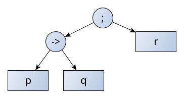
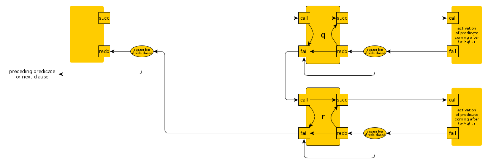

# Notes about if-then-else (and soft-cut)

A companion page for the entry [`->/2`](https://eu.swi-prolog.org/pldoc/doc_for?object=(-%3E)/2) in the SWI-Prolog manual.

## TOC

- [Naming](#naming)
- [Related: The soft-cut](#related_soft_cut)
- [_if-then-else_ explained](#if_then_else_explained)
   - [_if-then-else_ as wired up in the Byrd Box Model](#if_then_else_as_wired_up_in_the_byrd_box_model)
   - [_if-then_ as wired up in the Byrd Box Model](#if_then_as_wired_up_in_the_byrd_box_model)
   - [Implementing _\+/2_ with _->/2_ (and vice-versa)](#implementing_not_with_arrow_and_vice_versa)
- [Soft-cut: _*->_ with _;/2_](#soft_cut)
   - [_soft-cut_ as wired up in the Byrd Box Model](#soft_cut_as_wired_up_in_the_byrd_box_model)
- [How to avoid hard-to-read _->/2_ code](#avoid_hard_to_read_if_then_else_code)
- [Create a switch statement based on _->/2_](#switch_statement_based_on_if_then_else)
- [_->/2_ on the Prolog toplevel](#if_then_else_on_the_prolog_toplevel)
- [Making a goal deterministic with _->/2_](#make_goal_deterministic_with_if_then_else)
- [Use _->/2_ for guard expressions](#guard_expression)
- [Example for the soft-cut](#example_for_the_soft_cut)


## Naming<a name="naming"></a>

Do not call this construct an "implication". It really has little to do with
[material implication](https://en.wikipedia.org/wiki/Material_conditional)
(which is given by `:-` of course). It's just a Prolog flow control construct. 

Cal it _if-then-else_.

Or else "arrow" maybe. Arrow is already [used for something else](https://en.wikipedia.org/wiki/Arrow_%28computer_science%29) though.

## Related: The soft-cut<a name="related_soft_cut"></a>

There is another one called "soft cut": [`*->/2`](https://eu.swi-prolog.org/pldoc/man?predicate=*-%3E/2), which we will be looking at, too.

## _if-then-else_ explained<a name="if_then_else_explained"></a>

The construct [if-then-else](https://eu.swi-prolog.org/pldoc/doc_for?object=(-%3E)/2) construct is syntactically a bit special 
because the `->/2` operator is "helped" by `;/2` operator to yield a quasi-trinary operator:

**if-then-else as written**


**if-then-else as parsed**

`write_canonical/1` prints what it reads:

```
?- write_canonical((p->q;r)).
;(->(p,q),r)
true.

?- write_canonical((p->q);r).
;(->(p,q),r)
true.
```

In case there is no "else"

```
?- write_canonical(p->q).
->(p,q)
true.
```

So, `p->q;r` is parsed exactly the same as the "or" of `p->q` and `r`: Both expressions are indistinguishable syntactically.



However, the `;/2` immediately preceded by a `->/2` does not behave like an _or_ of two subexpressions: if the premiss
of `->/2` succeeds, then the right subexpression of `;/2`(here, `r`)  will **not** be called, unlike for a normal _or_,

This is what the manual means when it says:

> the combined semantics of this syntactic construct as defined above is different from the simple nesting of the two individual constructs

Define predicates which you can cause to succeed or fail by argument and which have several solutions:

```
p(X) :- format("[p(~q) clause 1]",[X]),call(X).
p(X) :- format("[p(~q) clause 2]",[X]),call(X).

q(X) :- format("[q(~q) clause 1]",[X]),call(X).
q(X) :- format("[q(~q) clause 2]",[X]),call(X).

r(X) :- format("[r(~q) clause 1]",[X]),call(X).
r(X) :- format("[r(~q) clause 2]",[X]),call(X).
```

Then:

```
?- 
p(true) -> q(true) ; r(true).

[p(true) clause 1][q(true) clause 1]
true ;
[q(true) clause 2]
true.
```

```
?- 
p(false) -> q(true) ; r(true).

[p(false) clause 1][p(false) clause 2][r(true) clause 1]
true ;
[r(true) clause 2]
true.
```

```
?-
p(true) -> q(false) ; r(true).

[p(true) clause 1][q(false) clause 1][q(false) clause 2]
false.
```

And with missing _else_ part:

```
?- p(false) -> q(true).
[p(false) clause 1][p(false) clause 2]
false.
```

``` 
?- p(true) -> q(true). 
[p(true) clause 1][q(true) clause 1]
true ;
[q(true) clause 2]
true.
```

``` 
?- p(true) -> q(false).
[p(true) clause 1][q(false) clause 1][q(false) clause 2]
false.
```

And this is exactly the same as the paranthesized `->/2` subexpression with the `;` coming after:

```
?- (p(true) -> q(true)) ; r(true).

[p(true) clause 1][q(true) clause 1]
true ;
[q(true) clause 2]
true.
```

etc.

### _if-then-else_ as wired up in the Byrd Box Model<a name="if_then_else_as_wired_up_in_the_byrd_box_model"></a>

More on the Byrd Box Model [here](../other_notes/about_byrd_box_model)

#### If `p` succeeds

There is no way that `r` will be called:


#### If `p` fails

Then `r` is called as for a normal _or_:


#### Compare with normal _or_

For a normal _or_ it is always possible that `r` can be called:



### _if-then_ as wired up in the Byrd Box Model<a name="if_then_as_wired_up_in_the_byrd_box_model"></a>

In case the _else_ part is missing, it is replaced by a `false` and we get (after replacing `r` by a `false`
box and splicing it out): 

**if-then or if-then-else-false as wired up in the Byrd Box model**


### Implementing _\+/2_ with _->/2_ (and vice-versa)<a name="implementing_not_with_arrow_and_vice_versa"></a>

`\+` and `->` are interchangeable:

On the one hand, as long as you can deal with calling the `If` part twice (otherwise you will need the cut, too):

```
my_if_then_else(_If,_Then,Else) :- call(If),call(Else).
my_if_then_else(If,Then,_Else)  :- \+ call(If),call(Then). 
```

On the other hand:

```
my_not(Goal) :- call(Goal) -> fail ; true.
``` 

The `->/2` is subject to _floundering_ in the same way as `\+` if there are
unbound variables shared between the _if_ goal and the _then_ goal. That circumstance
will make the program unsound (see: [floundering](/prolog_notes/edit/master/other_notes/about_negation/floundering.md)).

## Soft-cut: _*->_ with _;/2_<a name="soft_cut"></a>

Another construct, the [soft-cut](https://eu.swi-prolog.org/pldoc/doc_for?object=(*-%3E)/2), is 
built from `*->` and `;/2`, same as for `->/2` + `;/2`. However, unlike _if-then-else_,
it backtracks over the premiss, (`p` in our case).

`->/2` and `*->/2` are equivalent is the premiss succeeds at most once.

With the same `p/1`, `q/1`, `r/1` defined as above:

Then:

```
?- 
p(true) *-> q(true) ; r(true).

[p(true) clause 1][q(true) clause 1]
true ;
[q(true) clause 2]
true ;
[p(true) clause 2][q(true) clause 1]
true ;
[q(true) clause 2]
true.
```

```
?- 
p(false) *-> q(true) ; r(true).

[p(false) clause 1][p(false) clause 2][r(true) clause 1]
true ;
[r(true) clause 2]
true.
```

```
?- p(true) *-> q(false) ; r(true).

[p(true) clause 1][q(false) clause 1][q(false) clause 2][p(true) clause 2][q(false) clause 1][q(false) clause 2]
false.
```

And with missing _else_ part:

```
?- p(false) *-> q(true).
[p(false) clause 1][p(false) clause 2]
false.
```

``` 
?- p(true) *-> q(true). 
[p(true) clause 1][q(true) clause 1]
true ;
[q(true) clause 2]
true ;
[p(true) clause 2][q(true) clause 1]
true ;
[q(true) clause 2]
true.
```

``` 
?- p(true) *-> q(false).
[p(true) clause 1][q(false) clause 1][q(false) clause 2][p(true) clause 2][q(false) clause 1][q(false) clause 2]
false.
```

### _soft-cut_ as wired up in the Byrd Box Model<a name="soft_cut_as_wired_up_in_the_byrd_box_model"></a

#### If `p` succeeds


#### If `p` fails


## How to avoid hard-to-read _->/2_ code<a name="avoid_hard_to_read_if_then_else_code"></a>

Code using `->` becomes rapidly hard-to-read if the
predicate is "large" and has imbricated `->/2`. 
[Minimize Nesting](https://en.wikibooks.org/wiki/Computer_Programming/Coding_Style/Minimize_nesting)!. 

Example from the file `jpl.pl` of the Java Language Interface:

```none
jpl_type_to_class(T, RefA) :-
    (   ground(T)
        ->  (   jpl_class_tag_type_cache(RefB, T)
            ->  true
            ;   (   jpl_type_to_findclassname(T, FCN)
                ->  jFindClass(FCN, RefB),
                    jpl_cache_type_of_ref(class([java,lang],['Class']), RefB)
                ),
                jpl_assert(jpl_class_tag_type_cache(RefB,T))
            ),
            RefA = RefB
    ;   throw_instantiation_error(jpl_type_to_class/2,es01)
    ).
```

Not super-easy on the eyes.

Maybe use a helper meta-predicate. 
See [if(:If, :Then, :Else)](https://www.swi-prolog.org/pldoc/doc_for?object=sicstus:if/3) from SICStus Prolog.

A similar approach is described in the paper [Indexing `dif/2`](https://arxiv.org/abs/1607.01590) and 
in Ulrich Neumerkel's reification library [`reif.pl`](http://www.complang.tuwien.ac.at/ulrich/Prolog-inedit/swi/reif.pl).

Here are hand-coded predicates, which are relatively slow (they should be properly declared as metapredicates
exported from a module too, otherwise there will be problems with dereferencing the callable terms across
modules):

```
if_then_else(Condition,Then,Else) :- 
   call(Condition) -> call(Then) ; call(Else).

if_then(Condition,Then) :- 
   call(Condition) -> call(Then) ; true.

unless(Condition,Then) :- 
   call(Condition) -> true ; call(Then).
```

For example:

```
tryit(X) :- if_then((X > 0),(format("Yes, X is > 0: ~q\n",[X]))).
```

Then:

```
?- 
tryit(10).

Yes, X is > 0: 10
true.

?- 
tryit(-1).
true.
```

In the same way, for a switch statement, which is error-prone when written using `-</2` (see below), one could use:

```none
switch(If1,Then1,If2,Then2,If3,Then3,Else) :-
   call(If1)
   ->  call(Then1)
   ;   call(If2)
   ->  call(Then2)
   ;   call(If3)
   ->  call(Then3)
   ;   call(Else).
```

An example call:

```
switch(
    (PatchColFin < StrInLen),
     patched_string_with_suffix(StrIn,PatchStr,PatchCol,PatchColFin,StrOut),
    (PatchCol < StrInLen),
     patched_string_without_suffix(StrIn,PatchStr,PatchCol,StrOut),
    (StrInLen =< PatchCo),
     patched_string_append(StrIn,StrInLen,PatchStr,PatchCol,StrOut),
    cannot_happen_error("impossible case")).
```

Looks readable!

## Create a switch statement based on _->/2_<a name="switch_statement_based_on_if_then_else"></a>

Consider the expression:

```none
test1(A) -> exec1(A,B);
test2(A) -> exec2(A,B);
else(A,B)
```

better written

```none
test1(A) 
-> exec1(A,B)
;  test2(A)
-> exec2(A,B)
;  else(A,B)
```

Is this the correct way to write a switch statement or do we need to add parentheses? 

Answer: *Yes it is and no we don't.*
    
Here is how the expression is parsed:

```
write_canonical(
   (test1(A) -> exec1(A,B);
    test2(A) -> exec2(A,B);
    else(A,B))).
```

[`write_canonical/1`](https://eu.swi-prolog.org/pldoc/doc_for?object=write_canonical/1) prints:

```
;(->(test1(A),exec1(A,B)),;(->(test2(A),exec2(A,B)),else(A,B)))
```

Graphically (by hand, there must be a program somewhere to do that):

```
            ┌─────── test1(A)    
    ┌─── -> ┤  
    │       └─────── exec1(A,B)
 ; ─┤
    │              ┌──────── test2(A)
    │      ┌─── -> ┤  
    │      │       └──────── exec2(A,B)
    └─── ; ┤              
           └──── else(A,B)
```

Note that the "principal functor" of the if-then-else is, as usual, `;/2` and not `->/2`.

Anyway, that's how the expression **looks**, but that's not **how it is traversed**, as expected.

Testing the evaluation:

```none
mt(C) :-           
   test1(C) -> exec1(C);
   test2(C) -> exec2(C);
   else(C).
                  
test1(C) :- member(t1,C),  !,format("test1: succ\n").
test1(C) :- \+member(t1,C),!,format("test1: fail\n"),false.

test2(C) :- member(t2,C),  !,format("test2: succ\n").
test2(C) :- \+member(t2,C),!,format("test2: fail\n"),false.

exec1(C) :- member(e1,C),  !,format("exec1: succ\n").
exec1(C) :- \+member(e1,C),!,format("exec1: fail\n"),false.

exec2(C) :- member(e2,C),  !,format("exec2: succ\n").
exec2(C) :- \+member(e2,C),!,format("exec2: fail\n"),false.

else(C)  :- member(el,C),  !,format("else: succ\n").
else(C)  :- \+member(el,C),!,format("else: fail\n"),false.
```

Every test fails, then `else` is called (and succeeds):

```none
?- 
mt([e1,e2,el]).

test1: fail
test2: fail
else: succ
true.
```

test2 succeeds, then `exec2` is called (and succeeds)

```none
?- 
mt([t2,e1,e2,el]).

test1: fail
test2: succ
exec2: succ
true.
```

test1 succeeds, then `exec1` is called (and succeeds):

```none
?- 
mt([t1,e1,e2,el]).

test1: succ
exec1: succ
true.
```

## `->/2` on the Prolog toplevel<a name="if_then_else_on_the_prolog_toplevel"></a>

You can use `->/2` on the Prolog toplevel, like any operator. 
(This is far from asking whether a Horn clause is actually implied by the program ... which cannot be done)

Define

```none
a(1).
b(10).
b(11).
c(100).
c(101).
```

Then:

```none
?- a(X) -> b(Y).
X = 1, Y = 10 ;
X = 1, Y = 11.
```

But also:

```
a(1).
a(2).
b(1).
```

```
?- 
a(X) -> b(X).
X = 1.
```

**The God of Logic would be displeased if this were a proper implication** because, as an implication, `a(X) -> b(X)` should respond
false: `a(2)` is TRUE but `b(2)` is FALSE. But `a(X) -> b(X)` is just a control construct, so we are getting a pass.

## Making a goal deterministic with _->/2_<a name="make_goal_deterministic_with_if_then_else"></a>

The "premiss" of `->/2` is not subject to backtracking. 
This can be advantageous if you want to suppress multiple answer. 
Alternatively, and IMHO far clearer for the next one who reads your code, you could use
[once/1](https://eu.swi-prolog.org/pldoc/doc_for?object=once/1), expressing intent properly.

```none
?- 
member(X,[1,2,3]) -> (write("yes")) ; true.

yes
X = 1.
```

The "consequent" is still subject to backtracking:

```
?- 
member(X,[1,2,3]) -> (write("yes");write("yeah")) ; true.

yes
X = 1 ;
yeah
X = 1.
```

## Use _->/2_ for guard expressions<a name="guard_expression"></a>

To perform tests immediately after the head unification succeeded, in case the head is not discriminatory enough:

```
choo(X) :- var(X)    -> (!,format("It's a var",[])).   % we still need a cut to commit to this clause
choo(X) :- nonvar(X) -> format("It's not a var",[]).
```

This is an alternative to the usually seen:

```
choo(X) :- var(X)    ,!,format("It's a var",[]).
choo(X) :- nonvar(X) ,  format("It's not a var",[]).
```

Is it clearer? It depends...

## Example for the soft-cut<a name="example_for_the_soft_cut"></a>

As used in package [condition](https://eu.swi-prolog.org/pack/list?p=condition):

Given a `Condition`, ask applicable "handlers" (represented naturally by a set of
clauses of predicate `handler/2`) for their advice, which is a `Restart`value: 

```none
signal(Condition,Restart) :-
    ( handler(Condition,Restart) *-> true ; throw(Condition) ).
```

`signal/2` backtracks over all possible handlers (i.e. yields successive values for `Restart`), 
but if there are no handlers for that `Condition` (i.e. the call to `handler/2` fails immediately
or there are no `handler/2` predicates in the database at all), throws the term `Condition` instead.

Declare `handler/2` as dynamic:

```none
?- dynamic handler/2.
```

Then:

```none
?- 
signal(foo,Restart).

ERROR: Unhandled exception: foo
```

Add some handler knowledge:

```
?- 
assertz(handler(foo,"What, me worry?")),
assertz(handler(foo,"You don't want to mention this on the daily report.")),
assertz(handler(foo,"All company reps must report to their nearest synthetic!")).

?- 
signal(foo,Restart).

Restart = "What, me worry?" ;
Restart = "You don't want to mention this on the daily report." ;
Restart = "All company reps must report to their nearest synthetic!".

?- signal(bar,Restart).

ERROR: Unhandled exception: bar
```
