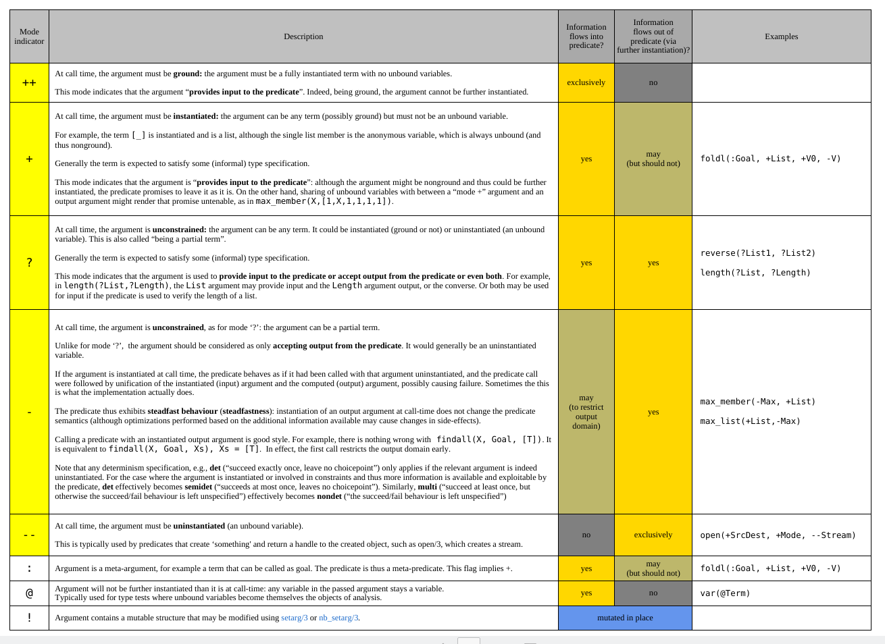

# Mode indicators

This is a companion page to the SWI-Prolog manual page [Notation of Predicate Descriptions](https://eu.swi-prolog.org/pldoc/man?section=preddesc)

## The cheat sheet

- [ODS (Open Office Spreadsheet)](mode_indicators.ods)
- [PDF](mode_indicators.pdf)
- [PNG](mode_indicators.png)

## Modes according to the ISO standard

The ISO standard mentions modes on page 64, _chapter 8.1.2.2: Mode of an argument_

> The mode of each argument defines whether or not anargument shall be instantiated
> when the built-in predicateis executed. The mode is one of the following atoms:
>
> `+` : the argument shall be instantiated ; 
> `?` : the argument shall be instantiated or a variable ; 
> `@` : the argument shall remain unaltered ; 
> `-` : the argument shall be a variable that will be instantiated iff the goal succeeds.
>
> NOTE: When the argument is an atomic term, there is no difference between the modes
> `+` and `@`. The mode `@` is therefore used only when the argument may be a compound term.

Let's interprete this. But let's note immediately that the description for `-` is a bit deficient.
First, if the goal fails, there certainly won't be any instantiations (that's the idea behind Prolog after all).
Secondly, the wording implies that on success, the _must_ be instantiation. But will this instantion be full or
partial? Let's immediately note that the above meaning of `-` is not the one found in the SWI-Prolog manual.

To shorten the upcoming text, let's be pedantic for a few paragraphs:

- _VAR_ : **The argument is a variable**: The argument (if it were named with a variable name) would denote
          an empty storage cell: The argument is an unbound variable. One abuses language and just says
          _"The argument is a variable"_ or even _"The argument is a var"_. Or one could also
          say _"The argument is uninstantiated"_. Clear enough.
- _UNC_ : **The argument is unconstrained**: The argument (if it were named with a variable name) would denote an 
          empty storage cell or a ground or nonground term. There seems to be no proper adjective for this case,
          but _"unconstrained"_ seems a good designation.
- _INS_ : **The argument is instantiated**: The argument (if it were named with a variable name) would denote
          a ground or nonground term but _not_ an empty cell. One can also say _"The argument is not an unbound variable"_,
          _"The argument is not a variable"_ or even _"The argument is nonvar"_. The positive 
          _"The argument is instantiated"_ is best. 
- _GND_ : **The argument is ground**: The argument (if it were named with a variable name) would denote a ground term. 
          The ground term can be anything from an atom or an atomic term to a directed graph (built out of compound terms,
          possibly with cycles), as long as there are no empty storage cells in that graph.

Compare with the lingo used for lists:

- _Closed List_ or _Proper List_: A list which is properly terminated with `[]` (at the list's FIN position)
- _Open List_: A list which is not properly terminated with a '[]' but has an unbound variable at the FIN position instead. Generally
  an unbound variable is _also_ allowed as an _Open List_ (but that really itches conceptually because an unbound variable could be _anything_).

Ok, so, the interpretation of the ISO standard text:

- `+` : At call time, the argument is _INS_. 
        Used as *input* at call time, but can be further instantiated if nonground for *output*.
- `?` : At call time, the argument is _UNC_. 
        Used as *input* at call time, but can be further instantiated if nonground or a variable for *output*.
- `@` : The argument is UNC but will not be modified.
        Used for *input only*. Generally, unbound variables in the argument become objects of analysis & processing themselves.
- `-` : At call time, the argument is _VAR_ and it _must_ be (further) instantiated by the called predicate.
        This is *output only*, even *forced output*.

## Modes in SWI-Prolog.

Let's take a look:

- 
